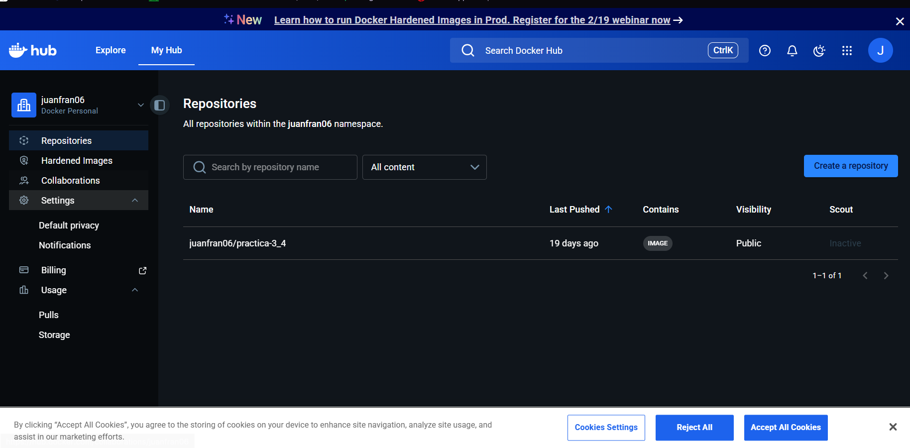
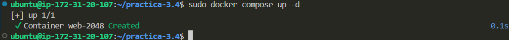
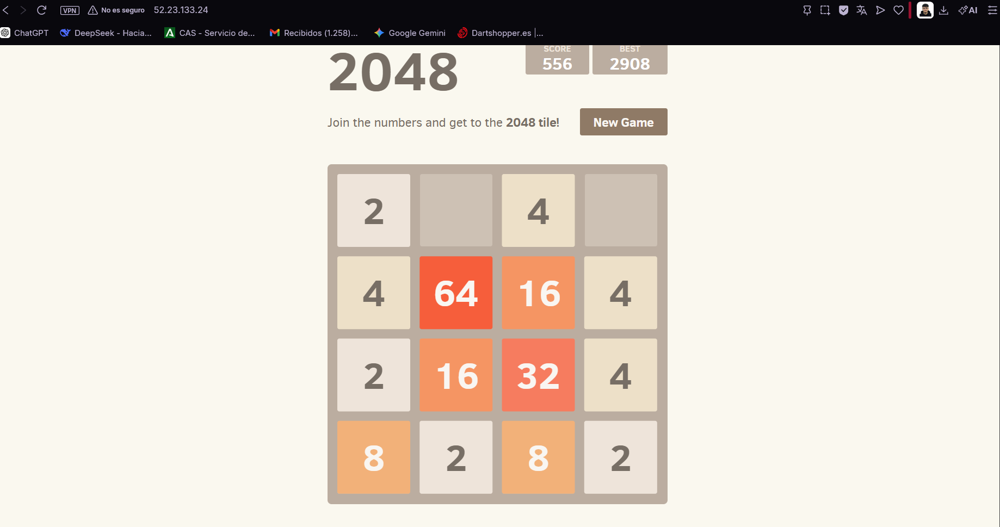

# Práctica: «Dockerizar» una web estática y publicarla en Docker Hub

**Asignatura:** Despliegue de Aplicaciones Web  
**Curso:** 2025/2026  
**Alumno:** Juan Francisco Pérez Bautista  
**URL del Proyecto:** [https://github.com/jperbau050/practica-3.4](https://github.com/jperbau050/practica-3.4)

---

## 1. Introducción
En esta práctica se ha creado una imagen personalizada de Docker para alojar el juego estático **2048**. El proceso incluye la creación de un `Dockerfile` basado en Ubuntu, la publicación de la imagen en **Docker Hub** y su posterior despliegue en una instancia **AWS EC2** mediante **Docker Compose**.

---
## 2. Construir una imagen y subirla en docker hub
**Construir la imagen:**
docker build -t nginx-2048 .

**Etiquetarla para tu perfil:**

Cambia **tu-usuario** por el tuyo real de docker hub y yo lo he llamado **nginx-2048:latest** tu puedes ponerle el nombre que quieras

docker tag nginx-2048 tu-usuario/nginx-2048:latest

**Subirla a docker hub**
docker login (te proporciona una clave corta que siguiendo el enlace que te proporciona te dejara iniciar sesion)
docker push tu-usuario/nginx-2048:latest

## 3. Creacion de docker-compose

Utilizamos la imagen subida de docker hub 

services:
  juego-2048:
    image: juanfran06/practica-3_4:1.0  
    container_name: web-2048
    ports:
      - "80:80"
    restart: always
## 4. Creación de Dockerfile
Siguiendo los requisitos de la práctica, se ha redactado un archivo `Dockerfile` con la siguiente configuración:

FROM ubuntu:latest 

RUN apt-get update && apt-get install -y nginx git && rm -rf /var/lib/apt/lists/* # Clona el juego en el directorio correcto
RUN rm -rf /var/www/html/* && git clone https://github.com/josejuansanchez/2048 /var/www/html/

EXPOSE 80

CMD ["nginx", "-g", "daemon off;"]

## 5. Resultados

